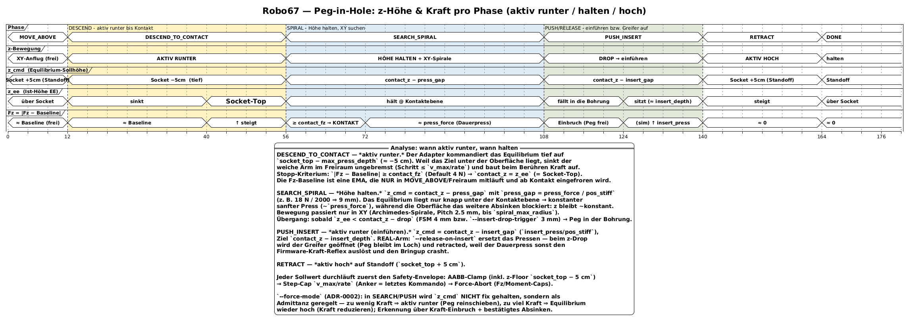

# Robo67

**EE26 Hackathon, München, Juni 2026.**
45 Stunden, um einem Roboterarm beizubringen, einen Stift in ein Loch zu stecken.
Ja, wir wissen es. Die Witze schreiben sich von selbst. Wir haben sie alle schon gehört.

Wir sind Team 67. Wir haben einen Franka Panda, zwei Webcams an Tischlampen festgeklebt, und eine gefährliche Menge Koffein.
Das Ziel: klassische Bild- und Kraftregelung. Keine neuronalen Netze. Kein Leiden. (Etwas Leiden.)


> Der Aufbau: Franka Emika Panda, roter Stift im Greifer, weiße Socket-Würfel, Overhead-C920 an der Schreibtischlampe — und der Not-Aus immer in Reichweite.

---

## Notion:

link: https://munichstart.notion.site/EE26-Hacker-Handbook-37e768068632809f9b84df427a5ca8c7

---

## Die Aufgabe

**Challenge 1 — Stift-in-Loch-Insertion**
Socket mit der Kamera erkennen, Arm darüber ausrichten, Stift mit nachgiebiger Kraftregelung einführen.
Wenn es klappt: Ruhm. Wenn nicht: Spiralsuche. Wenn das auch nicht klappt: Eigen-Version prüfen.

Der Roboter ist ein Franka Emika Panda (`192.168.1.67/desk/`).
Der Controller-Stack ist [`multipanda_ros2`](https://github.com/tenfoldpaper/multipanda_ros2).
Der Branch heißt `jearningers`. Main ist für Leute mit Zeit.

---

## Architektur

Zwei ROS-2-Nodes (SIM & REAL) fahren **dasselbe** kanonische Phasenmodell
(`insertion_intent`) — SIM und REAL unterscheiden sich nur im Command-Path-Adapter
und im Safety-Profil. Die ganze Logik steckt in puren, host-testbaren Seams
(`pytest`, kein rclpy / ROS / cv2).


Der Ablauf als Zustandsmaschine: Wahrnehmung → `MOVE_ABOVE` → `DESCEND_TO_CONTACT`
→ `SEARCH_SPIRAL` → `PUSH_INSERT` → `CONFIRM` → `RETRACT`. Jeder Sollwert läuft
zuerst durch den Safety-Envelope (Workspace-AABB + Step-Cap + Kraft-Abort).


z-Höhe und Kraft pro Phase — wann **aktiv runter**, wann **Höhe halten**, wann **einführen**:



Quellen: PlantUML in [`docs/architecture/diagrams/`](docs/architecture/diagrams/)
(`.puml` → gerendert als `.svg`/`.png`); mehr Details in
[`docs/architecture/`](docs/architecture/) und [`CLAUDE.md`](CLAUDE.md).

---

## Dokumentation

```
docs/
  cameras.md                   # zwei Overhead-Webcams + Intel RealSense D405 Tiefenkamera, Geräte-Nodes, Belichtung
  franka/
    specs.md                   # Gelenkgrenzen, kartesische Grenzen, nicht überschreiten
    fci_overview.md            # 1-kHz-FCI-Architektur, exklusives Desk/FCI-Gesetz
    bringup_api.md             # ros2-launch-Beschwörungen und Service-Namen
  hackathon/
    hacker_handbook.md         # Zeitplan, Orte, WLAN, Essen, Schlafen
    intel_challenge.md         # vollständiges Challenge-Briefing, Zugangsdaten, Software-Stack, Bonuspunkte
```

---

## Schnellreferenz

| Ding                 | Wert                                                                                              |
| -------------------- | ------------------------------------------------------------------------------------------------- |
| Franka Desk          | `https://192.168.1.67/desk/` — Benutzer `franka` / Passwort `frankaRSI`                           |
| Schwarze Workstation | Passwort `ee26`                                                                                   |
| Intel Workstation    | Passwort `H@ckathon2026`                                                                          |
| Controller-Topic     | `/cartesian_impedance/pose_desired` — Float64MultiArray [px,py,pz, R00..R22]                      |
| Fehlerbehebung       | `ros2 service call ~/service_server/error_recovery std_srvs/srv/Trigger {}`                       |
| Webcam-Aufnahme      | `gst-launch-1.0 v4l2src device=/dev/video0 num-buffers=1 ! jpegenc ! filesink location=cam0.jpg` (Microdia) · `device=/dev/video8 … cam1.jpg` (C920) |
| D405 Farbbild        | `gst-launch-1.0 v4l2src device=/dev/video6 num-buffers=1 ! jpegenc ! filesink location=cam_d405.jpg` |
| D405 Live-Vorschau   | `gst-launch-1.0 v4l2src device=/dev/video6 ! videoconvert ! autovideosink` · Tiefe: `realsense-viewer` |
| C920-Belichtungsfix  | `v4l2-ctl -d /dev/video8 --set-ctrl=auto_exposure=1,exposure_time_absolute=150`                   |

---

## Regeln, die wir auf die harte Tour gelernt haben

- **Niemals den Gelenkpositions-Controller benutzen.** Schlechtes Motorverhalten. Man bereut es.
- **Nur Eigen 3.3.9.** 3.4.0 zerstört die Kompilierung. Nicht fragen.
- **FCI und Desk können nicht gleichzeitig laufen.** Ein Befehlshaber. Wie in einer guten Küche.
- **Nach einer ControlException:** `error_recovery` aufrufen, Controller nicht neu laden.
- **Erst in MuJoCo prototypen.** Die Simulation nutzt denselben Controller. Hardware zuletzt anfassen.

---

## Stack

- ROS 2 Humble, Ubuntu 22.04
- `multipanda_ros2` (Branch `humble`) — Panda-Treiber + identische MuJoCo-Simulation
- `libfranka` 0.9.2, MuJoCo 3.2.0, Eigen **3.3.9**
- Kartesischer Impedanz-Controller für nachgiebigen Kontakt
- Zwei Overhead-Webcams (`/dev/video0` Microdia, `/dev/video8` C920) — statisch, extern
- Intel RealSense D405 Tiefenkamera (`/dev/video2` Tiefe, `/dev/video6` Farbe) — **am Arm montiert (eye-in-hand)**, bewegt sich mit dem Roboter; braucht Hand-Auge-Kalibrierung


> Die D405 am 3D-gedruckten Halter — eye-in-hand, fährt mit dem Greifer mit. Im Hintergrund: der Flansch und (natürlich) der Not-Aus.

---

_Benannt nach der IP-Adresse des Roboters. Wir sind nicht kreativ. Wir sind Ingenieure._
