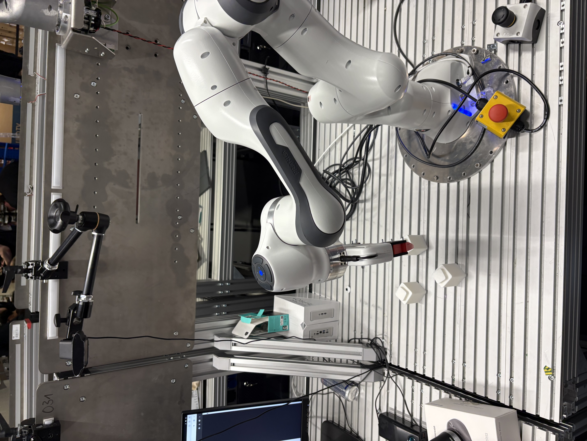
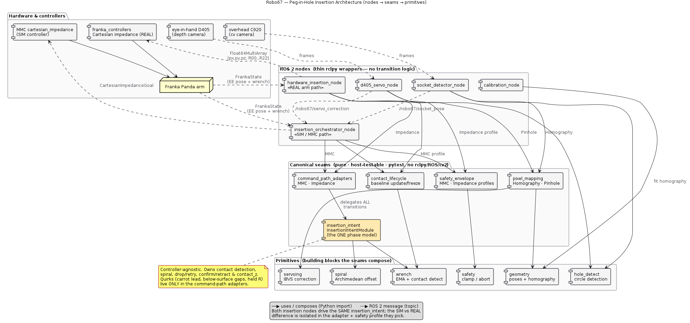
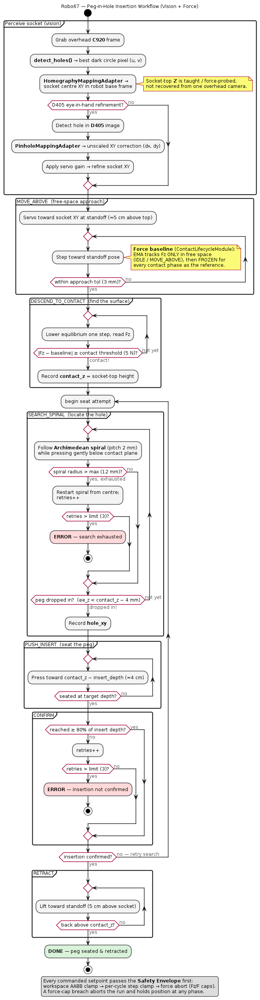
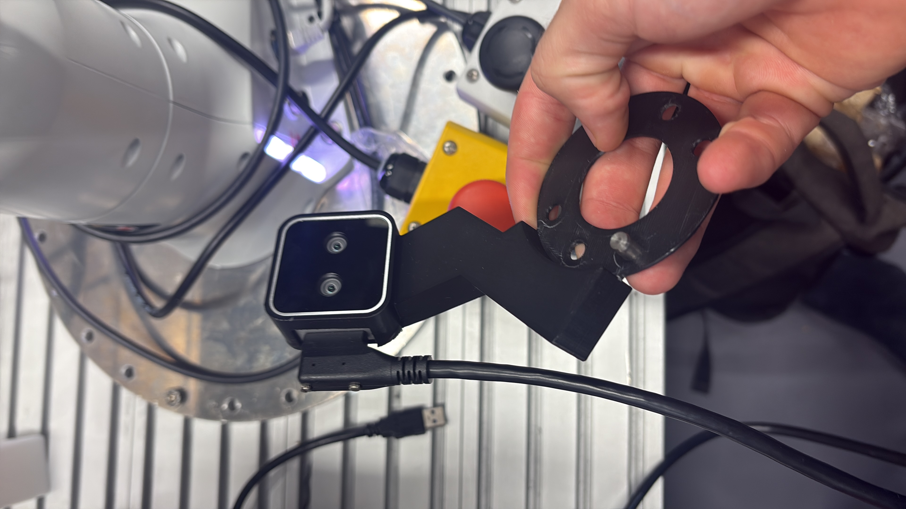

<<<<<<< Updated upstream
# Robo67

**EE26 Hackathon, Munich, June 2026.**
45 hours to teach a robot arm to put a peg into a hole.
Yes, we know. The jokes write themselves. We've heard them all already.

We're Team 67. We have a Franka Panda, two webcams taped to desk lamps, and a dangerous amount of caffeine.
The goal: classical vision and force control. No neural nets. No suffering. (Some suffering.)



> The setup: Franka Emika Panda, red peg in the gripper, white socket cubes, an overhead C920 on a desk lamp — and the e-stop always within reach.

---

## Notion

link: https://munichstart.notion.site/EE26-Hacker-Handbook-37e768068632809f9b84df427a5ca8c7

---

## The Challenge

**Challenge 1 — Peg-in-Hole Insertion**
Detect the socket with the camera, align the arm above it, insert the peg with compliant force control.
If it works: glory. If not: spiral search. If that doesn't work either: check the Eigen version.

The robot is a Franka Emika Panda (`192.168.1.67/desk/`).
The controller stack is [`multipanda_ros2`](https://github.com/tenfoldpaper/multipanda_ros2).
The branch is called `jearningers`. Main is for people with time.

---

## Architecture

Two ROS 2 nodes (SIM & REAL) drive the **same** canonical phase model
(`insertion_intent`) — SIM and REAL differ only in the command-path adapter and
the safety profile. All the logic lives in pure, host-testable seams
(`pytest`, no rclpy / ROS / cv2).



The flow as a state machine: perceive → `MOVE_ABOVE` → `DESCEND_TO_CONTACT`
→ `SEARCH_SPIRAL` → `PUSH_INSERT` → `CONFIRM` → `RETRACT`. Every setpoint first
passes through the safety envelope (workspace AABB + step cap + force abort).



Sources: PlantUML in [`docs/architecture/diagrams/`](docs/architecture/diagrams/)
(`.puml` → rendered as `.svg`/`.png`); more detail in
[`docs/architecture/`](docs/architecture/) and [`CLAUDE.md`](CLAUDE.md).

---

## Documentation

```
docs/
  cameras.md                   # two overhead webcams + Intel RealSense D405 depth camera, device nodes, exposure
  franka/
    specs.md                   # joint limits, Cartesian limits, do not exceed
    fci_overview.md            # 1 kHz FCI architecture, exclusive Desk/FCI rule
    bringup_api.md             # ros2 launch incantations and service names
  hackathon/
    hacker_handbook.md         # schedule, venues, WiFi, food, sleep
    intel_challenge.md         # full challenge briefing, credentials, software stack, bonus points
```

---

## Quick Reference

| Thing                | Value                                                                                             |
| -------------------- | ------------------------------------------------------------------------------------------------- |
| Franka Desk          | `https://192.168.1.67/desk/` — user `franka` / password `frankaRSI`                               |
| Black workstation    | password `ee26`                                                                                   |
| Intel workstation    | password `H@ckathon2026`                                                                          |
| Controller topic     | `/cartesian_impedance/pose_desired` — Float64MultiArray [px,py,pz, R00..R22]                      |
| Error recovery       | `ros2 service call ~/service_server/error_recovery std_srvs/srv/Trigger {}`                       |
| Webcam capture       | `gst-launch-1.0 v4l2src device=/dev/video0 num-buffers=1 ! jpegenc ! filesink location=cam0.jpg` (Microdia) · `device=/dev/video8 … cam1.jpg` (C920) |
| D405 color frame     | `gst-launch-1.0 v4l2src device=/dev/video6 num-buffers=1 ! jpegenc ! filesink location=cam_d405.jpg` |
| D405 live preview    | `gst-launch-1.0 v4l2src device=/dev/video6 ! videoconvert ! autovideosink` · depth: `realsense-viewer` |
| C920 exposure fix    | `v4l2-ctl -d /dev/video8 --set-ctrl=auto_exposure=1,exposure_time_absolute=150`                   |

---

## Rules We Learned the Hard Way

- **Never use the joint-position controller.** Bad motor behavior. You will regret it.
- **Eigen 3.3.9 only.** 3.4.0 breaks the build. Don't ask.
- **FCI and Desk can't run at the same time.** One commander. Like a good kitchen.
- **After a ControlException:** call `error_recovery`, don't reload the controller.
- **Prototype in MuJoCo first.** The sim uses the same controller. Touch hardware last.

---

## Stack

- ROS 2 Humble, Ubuntu 22.04
- `multipanda_ros2` (branch `humble`) — Panda driver + identical MuJoCo simulation
- `libfranka` 0.9.2, MuJoCo 3.2.0, Eigen **3.3.9**
- Cartesian impedance controller for compliant contact
- Two overhead webcams (`/dev/video0` Microdia, `/dev/video8` C920) — static, external
- Intel RealSense D405 depth camera (`/dev/video2` depth, `/dev/video6` color) — **arm-mounted (eye-in-hand)**, moves with the robot; needs hand-eye calibration



> The D405 on its 3D-printed mount — eye-in-hand, rides along with the gripper. In the background: the flange and (of course) the e-stop.

---

_Named after the robot's IP address. We're not creative. We're engineers._
=======
#https://munichstart.notion.site/EE26-Hacker-Handbook-37e768068632809f9b84df427a5ca8c7

https://192.168.1.67/desk/

https://frankarobotics.github.io/docs/doc/franka_ros2_humble/franka_bringup/doc/index.html

https://munichstart.notion.site/Intel-Industrial-Robotics-Arm-Challenge-37e768068632805b876edd037878fe12
>>>>>>> Stashed changes
